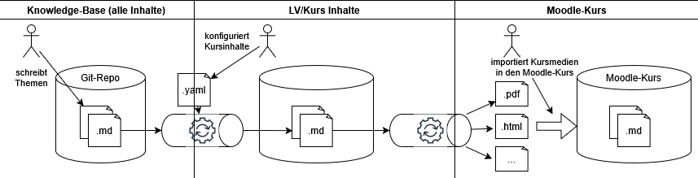

# MarkSlide Go

This project contains tools to manage a knowledge-base as hierarchicaly structured markdown-files. These files are converted to PDF- or HTML-slide decks using the MARP tool.



References:

* Markdown Presentation Ecosystem [MARP Official Site](https://marp.app)
* Markdown Explorer [VS Code Extension](https://github.com/BernLeWal/VSCode-MARX)
* PyMuPDF4LLM: https://pymupdf.readthedocs.io/en/latest/pymupdf4llm/

GitHub Repository of the project: [MarkSlideGo](https://github.com/BernLeWal/MarkSlideGo)


## Installation

When you want to run the MARP-tool on your local machine, then you have to install the framework as follows.
When you use the docker image for the generation process, then you just need docker installed and  forward to chapter "Usage with Docker".

* Create a [.env](.env) file in the project root. See [.env.sample](.env.sample)
* Install [Node.js](https://nodejs.org/en)  
    The Marp-Tool uses NodeJs > v16 which has to be installed prior to execution of the CLI tool.  
    Set the path to the npx-executable in the [.env](.env) file.
* Install the Marp CLI client
    For a local install use:
    ```shell
    npm install --save-dev @marp-team/marp-cli    
    ```
    Check if it works using:
    ```shell
    npx @marp-team/marp-cli@latest -v
    ```
* Install Google-Chrome (required for the html-rendering)
* Install the [Marp for VS Code](https://marketplace.visualstudio.com/items?itemName=marp-team.marp-vscode) extension
* Activate VS Code-Setting: Markdown > Marp: HTML  
    to support html-based styling and multi-column slides, see [https://github.com/orgs/marp-team/discussions/192#discussioncomment-1517399]
* Install Tesseract  
    Installers see [https://www.baeldung.com/java-ocr-tesseract#setup], Set the path to the tesseract-executable in the [.env](.env) file.
* Download and install better language files from [https://github.com/tesseract-ocr/tessdata/tree/main] (just replace the previously installed .traineddata files)
* Install Python (>3.10), create virtual environment (venv) and activate it
* Install the necessary python libraries
    ```shell
    pip install -r requirements.txt
    ```

## Run MARP on your local machine

### Marp-only usage (without MarkSlideGo scripts) to generate slides

* Change to the directory of the Markdown file
* To generate HTML run from there:  
    `npx marp <filename>.md -o <filename>.html --theme <path-to-_template-dir>/fhtw.css`  
    Remarks: replace the path to the files you want to generate.
* To generate PDF run:  
    `npx marp <filename>.md -o <filename>.pdf --allow-local-files --theme <path-to-_template-dir>/fhtw.css`  
    Remarks: replace the path to the files you want to generate.

### Automated generation of slides

Use the following scripts to generate the slide-decks in various formats:

* Change to the directory of the Markdown file
* Generate as PDF (with outlines and notes): ```python3 generate.py <filename>.md <filename>.pdf```
* Generate as HTML (presenter mode): ```python3 generate.py <filename>.md <filename>.html```
* Generate as PPTX (with notes): ```python3 generate.py <filename>.md <filename>.pptx```

### Automated generation of Moodle-course/-sections or -activities

You need to create a folder for your course under the [courses/](./courses/) directory - or just git clone your course-repos into it.

Usage: `python generate.py moodle <course> [<topic>] [<md_file>]`

Examples (using the courses-repo of bif3-swen1):
- generate complete course BIF3/SWEN1:  `python generate.py moodle bif3-swen1`
- generate specific topic SS-A only:    `python generate.py moodle bif3-swen1 SS-A`
- generate specific markdown file only: `python generate.py moodle bif3-swen1 Class-1 java-kickstart.md`

This will generate a Moodle Backup ZIP-File (.mbz) in the [output/](./output) subdirectory of your course directory. Just restore it in your Moodle LMS.

How the script works:
- it will recursivly collect all .md files
    - if a file has `marp: true` in the contents, Moodle resource and SCORM activities are created
    - if a file has `moodle: true`, Moodle lesson activities are created
- the activity name will be taken from the `title` property
- the section name will be taken from the directorys name where the .md-file is stored, or from the filename itself
- if in the containig directory there is a README.md, the section title will be taken from there (the first line with `# ...`)

### Generate course from selected material in catalog

see [courses/README.md](./courses/README.md)

## Run MARP using a Docker Image

You can use the Docker Image `codepunx/markslidego` in order to run the MARP-Tool and Generation Scripts without installing any of the NodeJS, MARP or Python stuff on your machine.
The only thing required is access to a docker installation.

Run the Docker image via Docker Hub:  
```shell
docker run -it --rm codepunx/markslidego /bin/bash
```

This opens a shell in the docker container, now you have to clone the courses

```shell
git clone <your-remote-repo> ./courses/<course-dir>
```

Then run the generation process, e.g.

```shell
python generate.py moodle <course-dir> [<filter_topic>] [<filter_md_file>]
```

Afterwards you'll find all the generated artifacts in `/app/courses/<course-dir>/output/`.

## Further Tools

### Full-Text Search the Knowledge-Base

Simply use the search-function of VSCode which effectively will find the files and lines where the search expression fits (like the command line tool grep)

### Generate Text/MD out of PDF-Files (with OCR)

It is possible to fill the Knowledge-Base also with PDF-Files. To make them searchable, the contents of the PDFs need to be converted to a (Markdown-based) textfile.
Use the pdf2md.py tool to get Markdown text, pdf2text.py to get unformated text.
Change to the directory of the PDF-file and run the tool:

```shell
~/dev/marp/catalogs/$ python3 pdf2text.py SpringBoot3-Infografik.pdf
~/dev/marp/catalogs/$ python3 pdf2md.py SpringBoot3-Infografik.pdf
```
